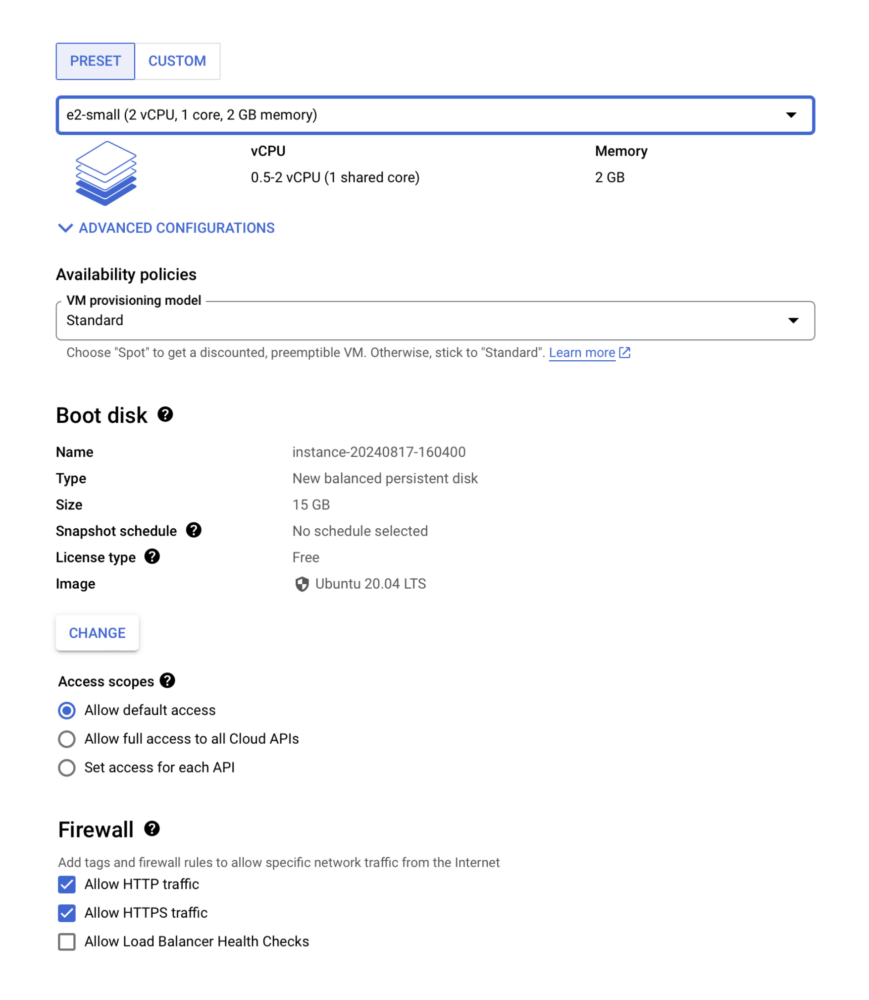
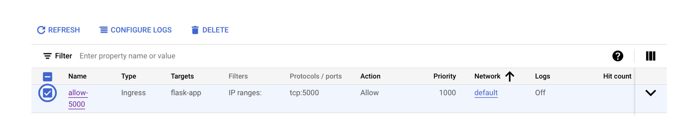
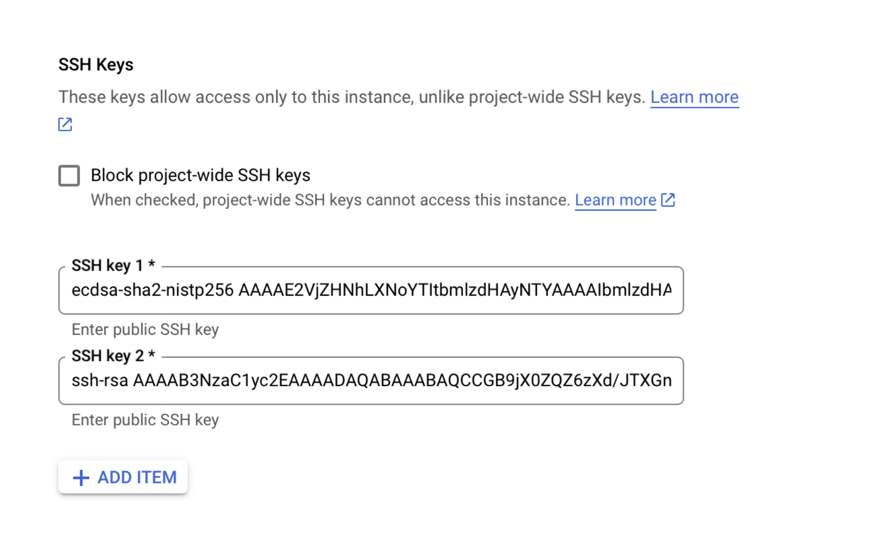

<h1 align="center">HealthAIoT Framework</h1>

HealthAIoT is a new architecture that utilises AIoT with cloud computing services to create a smart healthcare system. In our current implementation, HealthAIoT assesses the risk of developing Diabetes Mellitus in healthy individuals based on their personal health metrics and medical history; however, the proposed framework is fundamentally designed to be disease-agnostic and can be extended to incorporate detection and monitoring for other diseases. The HealthAIoT architecture consists of two main modules: a diabetes predictor and a cloud scheduler. The diabetes prediction module and cloud scheduler both utilise Multilayer Perceptron (MLP) models. 
The cloud scheduler manages health-related data and application requests from IoT devices, optimising resource utilisation and minimising the environmental impact of cloud services. The performance of the HealthAIoT framework is tested using realistic testbed CloudAIBus. Experimental results demonstrate that the MLP-based diabetes predictor achieves 78.30% accuracy and an F1-score of 0.7719 on unseen patient data while cloud scheduler achieves 93.6% accuracy. Further, system performance is evaluated using metrics including energy consumption, carbon-free energy usage, cost, execution time, and latency. By identifying individuals at the highest risk of developing diabetes, the framework enables targeted preventative interventions, optimise resource usage and maximises impact, while also serving as a foundational framework for broader healthcare applications.
<div align="center">
   <br>
</div>


## Dataset
The dataset used for training scheduler model is from Bitbrains and downloaded from
http://gwa.ewi.tudelft.nl/datasets/gwa-t-12-bitbrains, 
the downloaded dataset is presernt in the scheduler directory named `BitBrain61.csv`, and is called directly in `sch_train.py` script.

```bash
bitbrain_df = pd.read_csv('BitBrains61.csv', sep=';')
```
The dataset used for training diabetes predictor model is Health Indicators Dataset from CDC and fownloaded from
https://archive.ics.uci.edu/dataset/891/cdc+diabetes+health+indicators, which is imported using python library `ucimlrepo` directly in the `train.py` script of the worker directory.
```bash
pip install ucimlrepo

from ucimlrepo import fetch_ucirepo  
cdc_diabetes_health_indicators = fetch_ucirepo(id=891)
X = cdc_diabetes_health_indicators.data.features
y = cdc_diabetes_health_indicators.data.targets
```
For reference, the dataset csv file can also be downloaded from the link https://www.kaggle.com/datasets/alexteboul/diabetes-health-indicators-dataset .


## Prerequisites
### Dependencies

The Python dependencies can be installed using the following command within conda environment:
```bash
conda env create -f environment.yml
conda activate HealthAIoT
```

### Setting Up the Workers on VMs
1. Two Workers on Virtual Machines are configured on Google Cloud Platform (GCP) with 2vCPU (1 shared core), 2GB RAM, 15 GB Balanced Persistent Disk, operating on Ubuntu 20.04 LTS.
   

   It is important to **add the firewall rule** on "VPC firewall" to enable flask app on port 5000

   
   
   After completing VMs setup, run below cmd in the application directory locally to generate a public-private key pair
   ```bash
   ssh-keygen -t rsa -f ./id_rsa -C username
   ```
   
   On the GCP VM's edit section copy the public key to each VM SSH keys section
   

2. SSH using private key into each VM and run these set of commands on both worker VMs to update the kernel and install python and dependency required to run the application
```bash
ssh -i ./id_rsa username@VM-IP
```
  ```bash
  sudo apt update 
  sudo apt-get install python3 python3-pip 
  pip3 install Flask psutil
  pip3 install torch==1.13.1 --index-url https://download.pytorch.org/whl/cpu
  pip3 install joblib numpy
  pip3 install ucimlrepo imblearn
  ```
3. SCP (Secure Copy Protocol) specific scripts on both the VMs by running following command in the application main directory
```bash
tar -czvf worker.tar.gz -C worker app.py best_model.pth main_training.py scaler.pkl model_utils.py
scp -i ./id_rsa worker.tar.gz username@VM-IP:/home/username/
ssh -i ./id_rsa username@VM-IP
cd /home/username/
tar -xzvf worker.tar.gz
```
4. Run the `app.py` script on both the VMs to stats the flask app on port 5000. While the flask app is running on both the VMs the system metric stats are generated and stored on each VM at every interval of 10 sec in the file `system_stats.json`
```bash
python3 app.py
```
**Alternate Approach for Worker configuration**
1. Alternatively if we want, after **step 2** we can create three `.py` files directly on VMs and copy the code manually from repository
```bash
vim app.py
vim main_training.py
vim model_utils.py
```
2. Next we need to run the `main.py` script to train the predictor model, this will save the optimally trained predictor model as `best_model.pth` file and the StandardScalar training parameters as `scaler.pkl`. File `diabetic_model_train_val_test_log.txt` will be generated containing the logs of the model training process
```bash
python3 main_training.py
```
3. Run the `app.py` script on both the VMs to stats the flask app on port 5000
```bash
python3 app.py
```
**Note**: Instead of GCP, other cloud service platforms can also be used to deploy the Workers.

## Main Execution 
1. Once the flask app on both the Worker VMs are running and all the necessary modules installed on the local system, in the main HealthAIoT directory, run the **primary script** `scheduler.py` on the local system to start the application.
```bash
python3 scheduler.py
```
2. Once the script is running, users can access the website to input their data. The website is hosted on private IP on host 5002 in WLAN configuration. The website layout is shown below, HTML codes of HealthAIoT questionnaire and result page are present in templates directory `form.html` and `result.html`.
3. After successful user request-response cycle, two json files are generated `worker_system_metric_stats.json` and `temporal_stats.json`, which both contain the system metric information of the optimal Worker that handles the request.
Both the files are updated after every successful user request-response cycle. 
4. In case of any exception in which optimal Worker is not reachable, Broker stats is saved in both json files as Broker handles the user request.


## Cite this work
Our work is published in Internet of Things Journal, cite using the following bibtex entry:
```bibtex
@article{HealthAIoT,
    title = {{HealthAIoT: AIoT-driven smart healthcare system for sustainable cloud computing environments}},
    year = {2025},
    journal = {Internet of Things},
    author = {Wang, Han and Anurag, Kumar Ankur and Benamer, Amira Rayane and Arora, Priyansh and Wander, Gurleen and Johnson, Mark R. and Anjana, Ranjit Mohan and Mohan, Viswanathan and Gill, Sukhpal Singh and Uhlig, Steve and Buyya, Rajkumar},
    month = {3},
    pages = {101555},
    doi = {10.1016/j.iot.2025.101555},
    issn = {25426605}}
```
## License
This project is licensed under the Attribution–NonCommercial 4.0 - see the [LICENSE](LICENSE.txt) file for details.